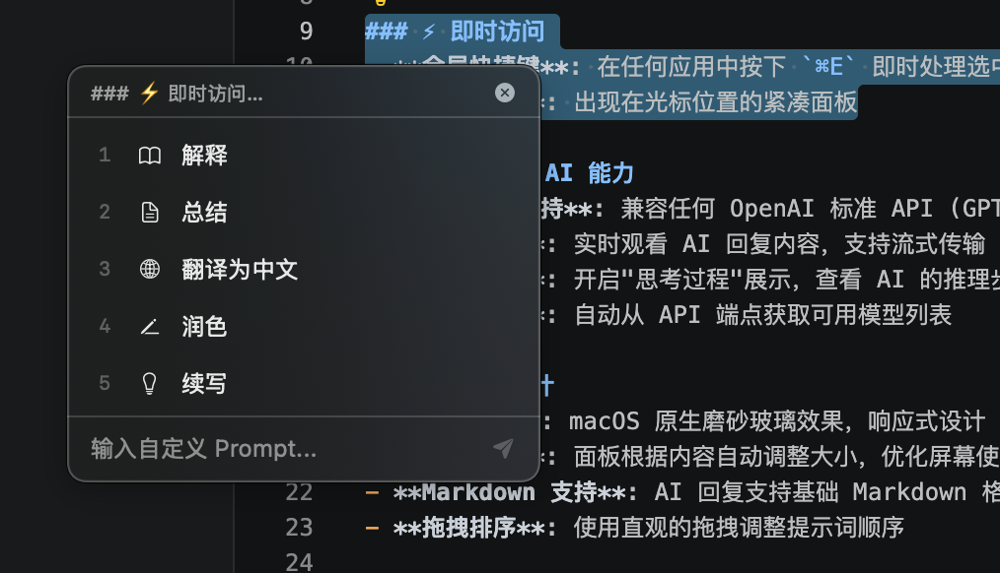
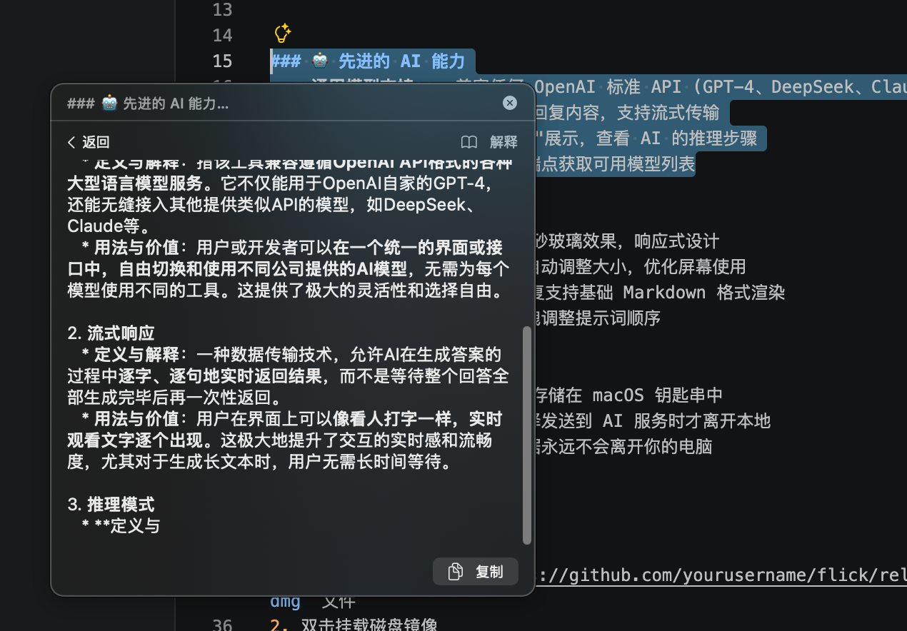
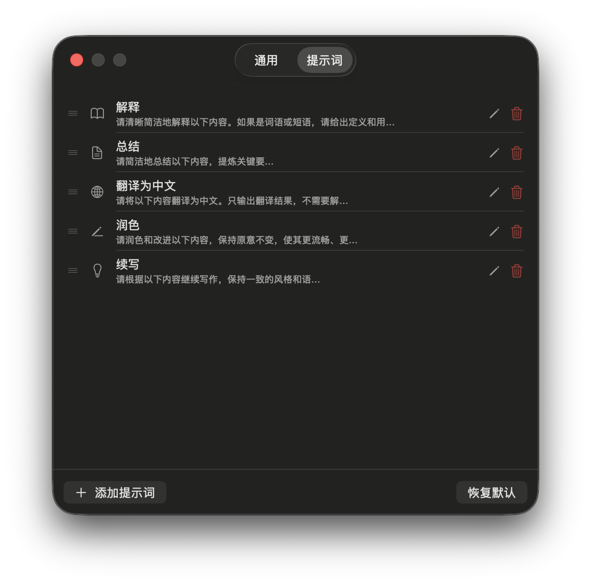
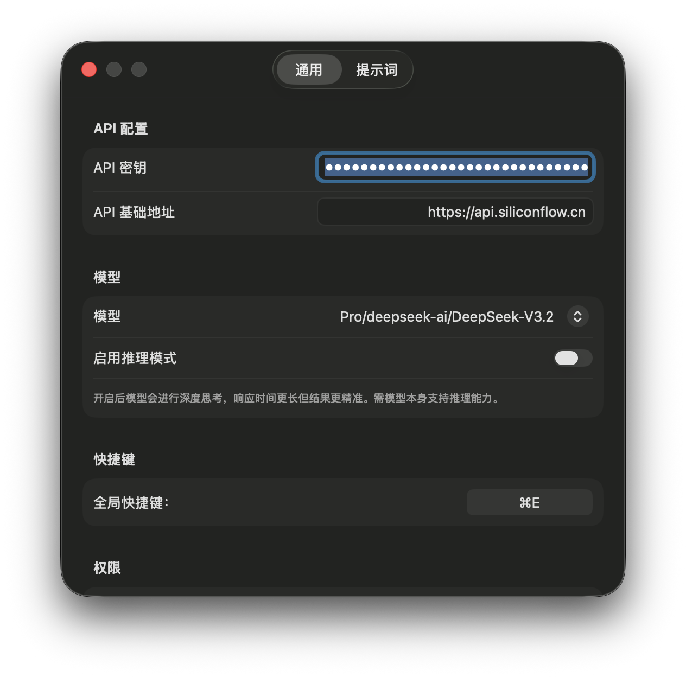

# Flick - macOS AI 文本处理工具

Flick 是一款优雅高效的 **全局AI调用工具**，它将 AI 驱动的文本处理带到你的指尖。只需一个简单的快捷键 (`⌘E`)，你就可以在任何 macOS 应用程序中使用 AI 模型处理选中的文本。

> 💡 **提示**: 非常适合作家、开发者、研究人员以及在 macOS 上处理文本的任何人！

## ✨ 核心功能概览

### ⚡ 即时访问

- **全局快捷键**: 在任何应用中按下 `⌘E` 即时处理选中文本
- **极简界面**: 出现在光标位置的紧凑面板


### 🤖 先进的 AI 能力

- **通用模型支持**: 兼容任何 OpenAI 标准 API (GPT-4、DeepSeek、Claude 等)
- **流式响应**: 实时观看 AI 回复内容，支持流式传输
- **推理模式**: 开启"思考过程"展示，查看 AI 的推理步骤
- **自动发现**: 自动从 API 端点获取可用模型列表

### 🎨 直观设计

- **简洁 UI**: macOS 原生磨砂玻璃效果，响应式设计
- **智能布局**: 面板根据内容自动调整大小，优化屏幕使用
- **Markdown 支持**: AI 回复支持基础 Markdown 格式渲染
- **拖拽排序**: 使用直观的拖拽调整提示词顺序

### 🔒 企业级安全

- **安全存储**: API 密钥安全存储在 macOS 钥匙串中
- **隐私优先**: 文本仅在你选择发送到 AI 服务时才离开本地
- **无数据收集**: 你的使用数据永远不会离开你的电脑

## 📦 安装

### 快速安装 (推荐)
1. 从 [Releases 页面](https://github.com/yourusername/flick/releases) 下载最新的 `.dmg` 文件
2. 双击挂载磁盘镜像
3. 将 `Flick.app` 拖拽到「应用程序」文件夹
4. 运行应用，并根据提示授予辅助功能权限

### 开发者安装
```bash
git clone https://github.com/yourusername/flick.git
cd flick
open Flick.xcodeproj  # 在 Xcode 中构建并运行
```

### 系统要求
- **macOS**: 26.0 或更新版本
- **权限需求**: 辅助功能权限 (读取选中文本) 和输入监控权限 (全局快捷键)

## 🚀 快速开始

### 1. 首次配置

当你首次启动 Flick 时：

1. **授予权限**：
   - 点击 "打开辅助功能设置" 启用文本选择读取
   - 在系统设置 → 隐私与安全性 → 辅助功能中启用辅助功能权限
   - 在输入监控中启用 Flick 应用

2. **配置 AI 服务**：
   - 点击菜单栏图标 → 设置
   - 输入你的 API 基础 URL (例如 `https://api.openai.com/v1`)
   - 添加你的 API 密钥 (安全存储在钥匙串中)
   - 点击 "刷新模型" 获取可用模型列表

### 2. 你的第一次 AI 请求
1. 在任何应用程序中选择文本
2. 按下 `⌘E` (Command + E)
3. 从浮动面板中选择预设提示词
4. 立即观看 AI 处理你的文本！

### 3. 自定义体验
- **添加自定义提示词**: 设置 → 提示词 → 添加新提示词
- **使用占位符**: 在选中文本应该出现的位置插入 `{{text}}`
- **重新排序**: 拖拽提示词调整顺序
- **快速访问**: 按下数字键 1-9 按位置选择提示词

## 🎯 内置提示词

Flick 默认包含以下有用的预设提示词：

| 图标 | 提示词 | 描述 |
|------|--------|------|
| 📖 | 解释 | 提供清晰的解释和定义 |
| 📝 | 总结 | 提取关键要点，创建简洁总结 |
| 🌐 | 翻译为中文 | 将文本翻译为中文 |
| ✏️ | 润色 | 提高清晰度、流畅性和专业性 |
| 💡 | 续写 | 按照相同风格生成延续内容 |
| 🧠 | 深度分析 | 详细分析，包含逐步推理 |
| 🔄 | 改写 | 用不同方式表达相同意思 |

> 💡 **专业技巧**: 创建常用提示词来构建你的个性化 AI 工具箱！

## 🔌 API 配置

### 兼容的服务
Flick 可与任何提供 OpenAI 兼容 API 的服务配合使用：

| 服务 | 基础 URL |
|------|---------|
| **OpenAI** | `https://api.openai.com/v1` |
| **DeepSeek** | `https://api.deepseek.com` |
| **Azure OpenAI** | `https://{your-resource}.openai.azure.com/openai/deployments/{deployment-name}` |
| **本地模型** | `http://localhost:8080/v1` |
| **Ollama** | `http://localhost:11434/v1` (需安装 OpenAI 兼容插件) |
| **LM Studio** | `http://localhost:1234/v1` |

### 高级配置
```
# 针对具有不同认证方式的本地模型服务器：
API 基础 URL: http://localhost:8000
自定义请求头: {"Authorization": "Bearer custom-token"}
启用/禁用流式传输: ✓
请求超时时间: 30秒 (可调整)
```

## 🛠️ 技术细节

### 架构概览
```
Flick.app (菜单栏应用)
├── AppDelegate (应用生命周期和设置)
├── GlobalHotkeyManager (⌘E 快捷键注册)
├── SelectionReader (通过模拟 ⌘C 提取文本)
├── AIService (支持流式传输的 API 通信)
├── FloatingPanelController (可调整大小的浮动 UI)
├── SettingsManager (配置持久化存储)
└── KeychainHelper (安全的凭据存储)
```

### 技术栈
- **编程语言**: Swift 5.9+
- **UI 框架**: SwiftUI & AppKit
- **目标平台**: macOS 26.0+
- **构建系统**: Xcode 15+
- **无外部依赖**: 纯原生 macOS 实现

### 安全与隐私
- **API 密钥**: 仅存储在 macOS 钥匙串中
- **文本处理**: 未经用户明确操作，选中文本不会离开你的系统
- **网络通信**: 所有 API 通信都使用带有标准加密的 HTTPS
- **本地存储**: 设置存储在 UserDefaults 中 (每个应用沙箱隔离)

## 🤔 常见问题

### Q: 为什么 Flick 需要辅助功能权限？
**A**: macOS 安全机制要求应用程序必须具备辅助功能权限才能从其他应用中读取文本。Flick 使用这些权限来模拟 `⌘C` 并获取你选中的文本。

### Q: 我可以使用免费的 AI 模型吗？
**A**: 当然可以！Flick 兼容任何 OpenAI 标准 API，包括免费和本地模型：
- [Ollama](https://ollama.ai/) (本地 LLM)
- [LM Studio](https://lmstudio.ai/) (本地图形界面)
- [OpenRouter](https://openrouter.ai/) (聚合模型)
- 许多自托管解决方案

### Q: 如何排查连接问题？
1. 验证你的 API 基础 URL 是否正确
2. 检查你的 API 密钥是否有效且有足够额度
3. 确保服务支持 `/chat/completions` 端点并启用流式传输
4. 暂时禁用任何 VPN 或防火墙
5. 检查 macOS 防火墙设置：系统设置 → 网络 → 防火墙

### Q: 我可以使用自定义快捷键吗？
**A**: 目前 Flick 使用 `⌘E` 作为默认快捷键。支持自定义快捷键的计划将在未来版本中实现。

### Q: 我的文本数据会被发送到其他地方吗？
**A**: **不会**。你的选中文本仅发送到你明确配置的 AI 服务。应用本身没有任何分析、遥测或外部数据收集。

## 👥 贡献指南

我们欢迎各种贡献！以下是你提供帮助的方式：

1. **报告问题**: [打开错误报告](https://github.com/yourusername/flick/issues)
2. **建议功能**: [分享你的想法](https://github.com/yourusername/flick/issues/new?labels=enhancement)
3. **提交代码**:
   ```bash
   git clone https://github.com/yourusername/flick.git
   cd flick
   git checkout -b feature/你的功能名称
   # 修改代码，然后创建 Pull Request
   ```

### 开发环境设置
```bash
# 1. 克隆并在 Xcode 中打开
git clone https://github.com/yourusername/flick.git
open flick.xcodeproj

# 2. 构建并运行
# 选择 "Flick" scheme
# 点击运行 (⌘R)
```

### 代码风格
- 使用 Swift 的现代并发特性 (`async/await`)
- 遵循 Apple 的 Swift API 设计指南
- 为公共 API 包含适当的文档
- 尽可能为新功能编写单元测试

## 📈 开发路线图

### 计划中的功能
- [ ] 可自定义的全局快捷键
- [ ] 高级 Markdown 渲染与语法高亮
- [ ] 图像输入支持 (截图转文本)


## 📞 支持与社区

### 获取帮助
1. **查看上面的 [常见问题](#-常见问题)** 寻找常见解决方案
2. **搜索现有的 [Issues](https://github.com/yourusername/flick/issues)** 寻找类似问题
3. **如果找不到答案，请打开新的 Issue**

### 报告问题时请包含
- Flick 版本 (可在设置 → 关于中查看)
- macOS 版本
- 你的 API 配置 (服务类型、选择的模型)
- 重现问题的步骤
- 任何相关的错误信息

### 与我们联系
- 🐛 [Issues](https://github.com/yourusername/flick/issues) - 报告错误或请求功能
- ⭐ **给项目加星** - 支持我们的工作！

## 📄 许可证

Flick 采用 MIT 许可证发布。详见 [LICENSE](LICENSE) 文件。

```
MIT 许可证

版权所有 (c) 2024 你的名字

特此免费授予任何获得本软件副本...
```

## 🙏 致谢

- 使用 ❤️ Swift 和 SwiftUI 构建
- 图标来自 [Lucide](https://lucide.dev/)
- 灵感来自生产力工具社区
- 感谢所有贡献者和测试者！

---

**祝你使用愉快！** ✨

无论你是编写文档、翻译内容、头脑风暴，还是仅仅探索 AI 能力，Flick 都旨在让 AI 助手变得轻松且融入你的日常工作流。尝试一下，体验在所有 macOS 应用程序中无缝处理文本！

---

*注：Flick 是一个独立项目，与 OpenAI、DeepSeek 或其他任何 AI 服务提供商无关。请确保你始终遵守所使用的 AI 提供商的服务条款。*
